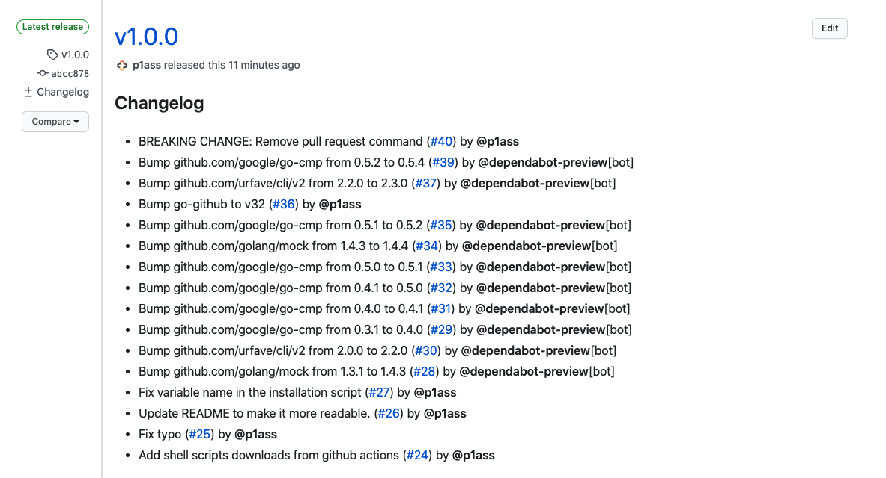
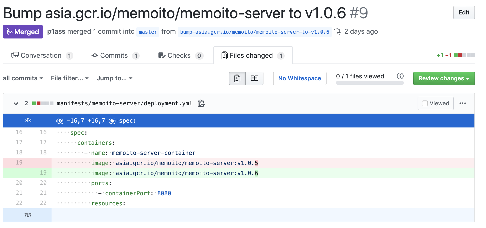

# mikku

[](https://github.com/p1ass/mikku/actions)
[](https://github.com/p1ass/mikku/actions)
[](https://img.shields.io/github/v/release/p1ass/mikku.svg)
[](https://github.com/p1ass/mikku/blob/master/LICENSE)
[](https://goreportcard.com/report/github.com/p1ass/mikku)

`mikku` is a CLI tool to help version management and Kubernetes manifest updates.

## Features
- Create GitHub releases with bumping Semantic Versioning tag 
- Send pull requests which update docker image tag.
- Support `{{.Owner}}` and  `{{.Repository}}` placeholder in environment variables and command-line options when setting configs.
	
## Installation

### From GitHub release

If you use Windows or Linux, replace `windows_amd64` or `linux_amd64` instead of `darwin_amd64`.

```bash
$ VERSION=0.2.0
$ curl -O -L https://github.com/p1ass/mikku/releases/download/v${VERSION}/mikku_${VERSION}_darwin_amd64.tar.gz
$ tar -zxvf mikku_${VERSION}_darwin_amd64.tar.gz
$ chmod a+x mikku
$ mv mikku /usr/local/bin/mikku
$ mikku --help
```


Binaries are available on GitHub releases. [p1ass/mikku/releases](https://github.com/p1ass/mikku/releases)

### go get

```bash
$ GO111MODULE=off go get github.com/p1ass/mikku/cmd/mikku
$ mikku --help
```

## Getting Started

### Prepare GitHub access token

You need an OAuth2 access token. Generate [personal API token](https://github.com/settings/tokens) with *repo* scope.

### Set environment variable

- `MIKKU_GITHUB_ACCESS_TOKEN`: your OAuth2 access token.
- `MIKKU_GITHUB_OWNER`: repository owner or org name. 
    - Ex. `p1ass` when `p1ass/mikku`

```bash
$ export MIKKU_GITHUB_ACCESS_TOKEN=[YOUR_ACCESS_TOKEN]
$ export MIKKU_GITHUB_OWNER=[GITHUB_OWNER_NAME]
```

### Create a new GitHub release to bump patch version

When the latest tag name is `v1.2.3`, the below command bump to `v1.2.4`.

```bash
$ mikku release sample-repository patch
```

Note that `mikku` doesn't build and push a docker image, so you have to do it using CI service such as CircleCI.


### Create a pull request updating docker image tag in Kubernetes manifest file

Update image tag in Kubernetes manifest file to the latest version.
```bash
$ export MIKKU_MANIFEST_REPOSITORY=sample-manifest-repository
$ export MIKKU_MANIFEST_FILEPATH=manifests/{{.Repository}}/deployment.yml
$ export MIKKU_DOCKER_IMAGE_NAME={{.Owner}}/{{.Repository}}

$ mikku pr sample-repository
```

```yaml
spec:
    containers:
    - name: sample-repository-container
        image: p1ass/sample-repository:v1.0.0
        ↓ Replace
        image: p1ass/sample-repository:v1.0.1
```


## Screenshots

### Release

```bash
$ mikku release sample-repository v0.1.1
```




### PullRequest

```bash
$ mikku pr memoito-server
```



## Commands

#### `mikku release <repository> <major | minor | patch | (version)>`

Create a tag and a GitHub release.
If you use `major`, `minor`, or `patch`, the latest tag name must be compatible with Semantic Versioning.

##### Arguments

- `major` : major version up
- `minor` : minor version up
- `path` : patch version up
- `version` : create tag with a given version. Ex. `v1.0.0`

##### Examples

```bash
$ mikku release sample-repository v1.0.0
$ mikku release sample-repository patch # v1.0.0 → v1.0.1
$ mikku release sample-repository minor # v1.0.1 → v1.1.0
$ mikku release sample-repository major # v1.1.0 → v2.0.0
```

#### `mikku pr [-m <manifest-repository>] [-p <path-to-manifest-file>]  [-i <image-name>] <repository>`

Create a pull request updating Docker image tag written in Kubernetes manifest file.


##### Options

If you don't set environment variables, you must add options when executing commands.

- `--manifest, -m`
    - Specify a repository existing Kubernetes manifest file.
    - Optional. 
    - Default : `MIKKU_MANIFEST_REPOSITORY` environment variable.

- `--path, -p` 
	- File path where the target docker image is written. 
    - Optional. 
    - Default : `MIKKU_MANIFEST_FILEPATH` environment variable.
    - You can use [text/template](https://golang.org/pkg/text/template/) in Go.
        - Support variable : `{{.Owner}}`, `{{.Repository}}`
    - Ex. `manifests/{{.Repository}}/deployment.yml`

- `--image, -i`
	- Docker image name.
	- Optional. 
    - Default : `MIKKU_DOCKER_IMAGE_NAME` environment variable.
    - You can use [text/template](https://golang.org/pkg/text/template/) in Go.
        - Support variable : `{{.Owner}}`, `{{.Repository}}`
    - Ex. `asia.gcr.io/{{.Owner}}/{{.Repository}}`


##### Examples

```bash
$ export MIKKU_GITHUB_ACCESS_TOKEN=[YOUR_ACCESS_TOKEN]
$ export MIKKU_GITHUB_OWNER=p1ass

# You need to set environment variables. Otherwise, add options when executing commands
$ export MIKKU_MANIFEST_REPOSITORY=manifest-repository
$ export MIKKU_MANIFEST_FILEPATH=manifests/{{.Repository}}/deployment.yml
$ export MIKKU_DOCKER_IMAGE_NAME=asia.gcr.io/{{.Owner}}/{{.Repository}}

# The most simple case
# When the latest tag name is `v1.0.1`,
# replace p1ass/sample-repository:v1.0.0 existing in manifest-repository to p1ass/sample-repository:v1.0.1.
$ mikku pr sample-repository

# Override manifest repository
$ mikku pr --manifest other-manifest-repo sample-repository

# Override Kubernetes manifest file
$ mikku pr --path {{.Owner}}/{{.Repository}}/deployment.yml sample-repository

# Override docker image name
$ mikku pr --image docker.example.com/{{.Repository}} sample-repository
```

## For developers

### Build


```bash
$ go build -o mikku cmd/mikku/main.go
```

### Tests

```bash
go test -v ./...
```

## LICENCE

MIT
